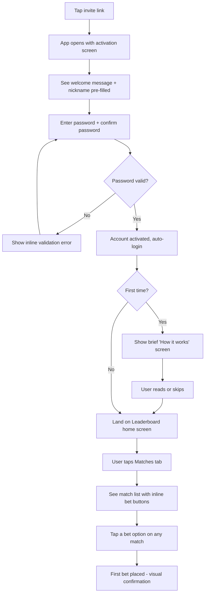
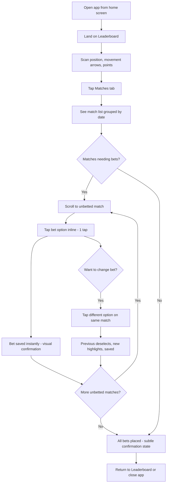
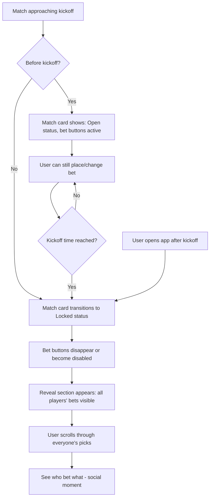
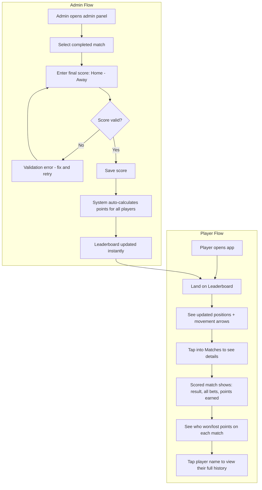
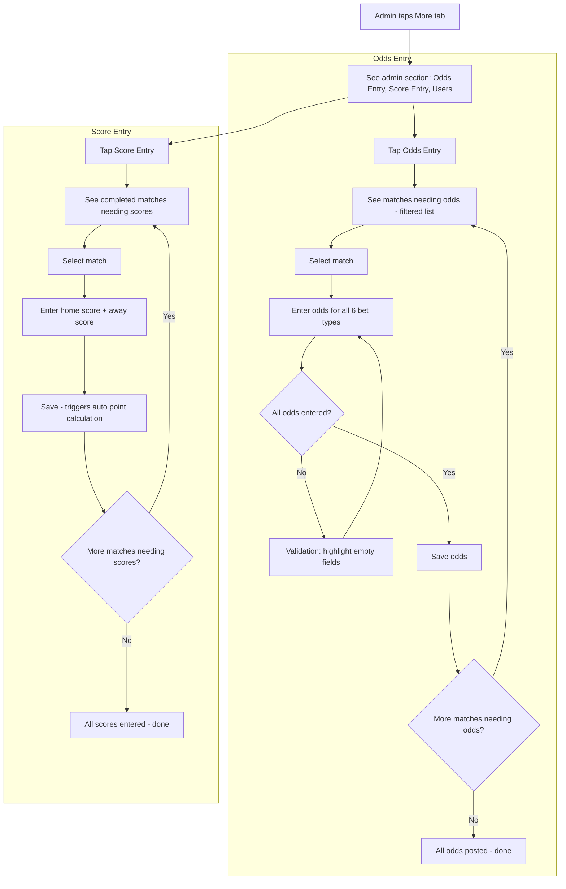
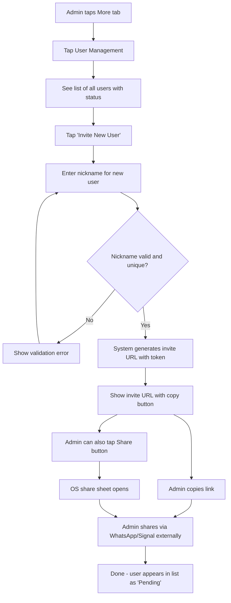

# UX Design Specification typerek-2.0

**Author:** Karol
**Date:** 2026-02-04

---

## Executive Summary

### Project Vision

Typerek is a private soccer prediction web app designed for closed friend groups competing during tournaments. The core UX philosophy is deliberate simplicity: open the app, check the standings, place a bet, move on. The app serves as a digital clubhouse where the competition itself -- not complex features -- drives engagement. Every design decision should reinforce speed, clarity, and the social thrill of friendly rivalry.

### Target Users

**Players (primary persona):** Friends in a private group (5-50 people) who access the app daily on their phones during a tournament. They are casual-to-moderate tech users who expect a modern mobile experience. Their core loop is: check leaderboard → browse matches → place/change bets → review results. Motivation is social competition and bragging rights.

**Admin (secondary persona):** The person hosting the instance -- also a player with no in-game privileges. Manages tournament operations: entering odds from bookmaker sites, recording match scores, inviting new players via token links. Uses desktop for admin tasks, mobile for playing.

### Key Design Challenges

1. **Deadline clarity and urgency:** The kickoff lock is absolute -- missed bets mean 0 points with no recourse. The UI must communicate match states (open/locked/scored) and time remaining at a glance, without relying on notifications.
2. **Graceful handling of incomplete data:** Matches exist before odds are posted. Players can bet without knowing point values. The interface must make this feel intentional, not broken.
3. **Information density on mobile screens:** Leaderboard rankings, match schedules, betting interfaces, and player histories all compete for attention on small screens. The design must prioritize scannability and fast task completion.

### Design Opportunities

1. **The kickoff reveal:** The moment all bets become visible at kickoff is a natural social event. Designing this reveal to feel like a shared moment can amplify engagement and group conversation.
2. **Leaderboard storytelling:** Position changes, point differentials, and momentum indicators can transform the leaderboard from a static ranking into a tournament narrative.
3. **Player history as identity:** A well-designed betting record gives each player a visible track record -- celebrating bold calls, safe strategies, and spectacular misses alike.

## Core User Experience

### Defining Experience

The core typerek experience is a daily ritual: open the app, see where you stand, place your bets, move on. The two primary actions -- betting and leaderboard checking -- are roughly equal in frequency and importance. Players cycle between them daily, with occasional dips into player history to analyze how rivals have been betting.

The defining interaction is **placing a bet before kickoff**. This is the only action with irreversible time pressure and the only action that generates points. Everything else in the app exists to support, motivate, or contextualize this single act.

### Platform Strategy

- **Mobile-first PWA:** Primary access pattern is phone, installed to home screen. The app must feel native -- fast transitions, touch-optimized targets, no browser chrome.
- **Desktop as secondary:** Admin tasks (odds entry, score entry, user management) benefit from larger screens, but players may also use desktop casually.
- **No offline mode:** All actions require server validation (especially the kickoff lock). Offline caching is limited to static assets for fast PWA cold starts.
- **Touch-first interaction model:** All primary flows designed for thumb-zone tapping on mobile. Desktop gets the same layout with hover/click refinements where useful.

### Effortless Interactions

1. **Multi-match inline betting:** Players should be able to bet on several upcoming matches in a single scrollable view without navigating in and out of individual match screens. See match → tap prediction → move to next match. Minimum taps, maximum throughput.
2. **Leaderboard at a glance:** Opening the app should immediately show standings. No loading screens, no intermediate navigation. The leaderboard is the home screen.
3. **Match state recognition:** Open, locked, and scored matches must be visually distinct at a glance. A player should never need to read text to understand whether they can still bet.
4. **Bet confirmation without friction:** Placing a bet should feel instant -- a single tap selects the prediction. No confirmation dialogs for placing or changing a bet (changing is just tapping a different option). The low stakes of a friend-group game don't warrant "are you sure?" prompts.

### Critical Success Moments

1. **First bet placed:** A new user who just activated their account via invite link should place their first bet within 60 seconds. If onboarding creates friction, engagement drops immediately.
2. **The kickoff reveal:** The moment a match locks and all bets become visible. This is the app's signature social moment -- the UI should make it satisfying to see what everyone picked.
3. **Morning-after leaderboard check:** After scores are entered and points calculated, opening the app to see position changes. Did you climb? Did your rival fall? This is the emotional payoff that drives the daily habit.
4. **The near-miss and the bold call:** Viewing match results where your bet barely missed or your underdog pick paid off big. The history view should make these moments legible and memorable.

### Experience Principles

1. **Speed over ceremony:** Every interaction should complete in the fewest taps possible. No confirmation dialogs, no loading states that block action, no unnecessary navigation layers. The app respects the player's time.
2. **Clarity over decoration:** Match states, deadlines, scores, and rankings must be immediately readable. Visual design serves comprehension first, aesthetics second. When in doubt, make it more obvious.
3. **Social by transparency:** The app creates social moments through information reveals (bet visibility at kickoff, leaderboard movements, player histories), not through social features (comments, reactions, chat). The conversation happens on WhatsApp -- typerek provides the fuel.
4. **Forgiving input, strict rules:** Placing and changing bets is casual and instant (tap to pick, tap again to change). But the kickoff lock is absolute and visible. The contrast between easy input and hard deadlines creates the game's tension.

## Desired Emotional Response

### Primary Emotional Goals

1. **Competitive excitement:** The thrill of a friendly rivalry -- checking standings, tracking rivals, seeing your position shift. The app should feel like a living competition, not a static form.
2. **Casual confidence:** Placing bets feels quick, decisive, and low-stakes. Players should feel empowered by the simplicity of 6 clear options, not overwhelmed by complexity. This is a card game with friends, not a casino.
3. **Social amusement:** The delight of seeing what everyone picked after kickoff. "You bet WHAT on Brazil?" moments that fuel WhatsApp conversations. The app provides the punchlines.

### Emotional Journey Mapping

| Stage | Desired Emotion | Design Implication |
|---|---|---|
| **First visit (invite link)** | Welcomed, curious | Frictionless onboarding -- set password, see matches immediately |
| **Opening the app (daily)** | Anticipation, engagement | Leaderboard-first home screen shows standings instantly |
| **Browsing matches** | Informed, in control | Clear match states, visible odds, obvious time remaining |
| **Placing a bet** | Decisive, confident | Single-tap selection, no confirmation friction, instant feedback |
| **Kickoff lock / bet reveal** | Excitement, social amusement | Everyone's picks visible -- the shared "reveal" moment |
| **Checking results** | Satisfaction or playful regret | Points calculated transparently, bold calls and near-misses visible |
| **Missing a deadline** | Mild self-directed frustration, not app-directed blame | No guilt-tripping UI. The app didn't fail them -- they simply missed it |
| **Returning next day** | Habitual pull, "let me check standings" | Leaderboard changes create daily narrative and motivation to return |

### Micro-Emotions

- **Confidence over confusion:** Match states, betting options, and point calculations must always be self-explanatory. A player should never wonder "did my bet go through?" or "why did I get these points?"
- **Belonging over isolation:** The invite-only model and shared leaderboard create a private clubhouse feeling. Even without social features, players should feel they're part of a group.
- **Excitement over anxiety:** Time pressure from kickoff deadlines should feel like game tension (fun), not work deadlines (stress). Visual countdowns should inform, not alarm.
- **Accomplishment over frustration:** Whether winning or losing, the app should make the experience legible. A player in last place should still find their history interesting, not depressing.

### Design Implications

- **Competitive excitement** → Leaderboard position changes visible, point differentials shown, movement indicators (up/down)
- **Casual confidence** → Single-tap betting, no confirmation dialogs, instant visual feedback on selection
- **Social amusement** → Bet reveal after kickoff designed as a moment, not just data appearing; player history accessible to all
- **Belonging** → Consistent private-group framing, no public-facing elements, warm but not childish visual tone
- **No gambling stress** → Points, not money. No loss language. No "you missed out" guilt patterns. Clean, game-like visual language.
- **Confidence from understanding** → First-time onboarding explains bet types (1, X, 2, 1X, X2, 12), odds-as-points scoring, kickoff lock rules, and missed-bet consequences. Brief, visual, shown once after account activation. A persistent "How it works" rules page is always accessible from navigation for reference -- covering scoring mechanics, bet type definitions, and game rules. Transparency of rules reinforces trust.

### Emotional Design Principles

1. **Game night, not game day:** The emotional register is friends around a table, not sports bettors at a screen. Design choices should evoke play, not stakes.
2. **Transparency builds trust:** Every point calculation is visible and verifiable. No black boxes. Players trust the system because they can see exactly how it works.
3. **The app stays quiet:** No notifications, no urgency patterns, no engagement tricks. The app is always there when you want it, never demanding attention. Missing a deadline is on you -- the app doesn't guilt-trip.
4. **Every position is a story:** Whether you're 1st or last, your betting record tells a story. The emotional design should make any position interesting, not just winning.

## UX Pattern Analysis & Inspiration

### Inspiring Products Analysis

**TradingView — Dense Data, Clean Interaction**

TradingView makes complex time-series financial data readable and interactive across devices. Key UX strengths:
- **Chart interaction on touch:** Pinch-zoom, crosshair on tap-hold, tooltips that don't obscure data. Touch gestures feel natural, not bolted on.
- **Information layering:** Overview first (the chart line), then detail on demand (hover/tap for exact values). Never overwhelms with everything at once.
- **Theming:** Clean dark and light modes with high contrast on data points. The UI stays out of the way so the data speaks.
- **Relevance to typerek:** The bump chart for leaderboard progression. TradingView's approach to interactive line charts on mobile is the gold standard for how player rankings over time should feel.

**Fantasy Premier League (FPL) — The Prediction Game Blueprint**

FPL is the closest UX analogue to typerek -- millions of users making weekly predictions in a competitive leaderboard format during the soccer season. Key UX strengths:
- **Leaderboard with movement indicators:** Position number + up/down arrows + points delta from previous gameweek. At a glance, you see standing AND momentum.
- **Gameweek structure:** Matches grouped by round with clear deadlines. The "deadline countdown" is prominent but not alarming -- a timestamp, not a flashing timer.
- **Points breakdown:** Per-player, per-gameweek scoring details. Every point is traceable to a specific decision. Transparency builds trust.
- **History navigation:** Gameweek-by-gameweek history with swipe or tap navigation. Easy to go back and review past performance.
- **Relevance to typerek:** Leaderboard movement patterns, deadline display conventions, points breakdown layout, match grouping by round.

**Duolingo — The Daily Habit Loop & Inclusive Design**

Duolingo has mastered making a daily action feel compelling through social competition and minimal friction -- for users of ALL tech skill levels, from teenagers to grandparents. Key UX strengths:
- **Leaderboard as motivator:** Weekly friend leaderboards with promotion/relegation zones create stakes without real consequences. Position matters socially.
- **Minimal friction to core action:** Open app → tap lesson → done. The daily action takes under 2 minutes. No navigation hunting.
- **Accessible to non-technical users:** Large touch targets, obvious tap affordances, no hidden gestures required. A 60-year-old who barely uses apps can complete the core action without help. This is the benchmark for typerek.
- **Playful but not childish tone:** Illustrations and micro-animations add personality without undermining the experience for adults. The tone is warm, not condescending.
- **Progress visibility:** Streaks, XP totals, and league positions are always visible. You always know where you stand.
- **Relevance to typerek:** The "open and act immediately" flow, leaderboard as social fuel, tone calibration for an adult friend group, and critically -- the proof that simple design can serve both tech-savvy and non-technical users simultaneously.

### Transferable UX Patterns

**Navigation Patterns:**
- **Leaderboard-first home screen** (FPL, Duolingo) — The competitive standings view is the default landing. No dashboard, no feed, just rankings. Typerek should open to the leaderboard.
- **Tab-based primary navigation** (all three) — Bottom tab bar on mobile for the 3-4 core views (leaderboard, matches, history, admin). No hamburger menus for primary actions. Tabs are always visible -- a non-technical user can never get "lost" because the main sections are always one tap away.

**Interaction Patterns:**
- **Inline action without navigation** (Duolingo) — The core action is available immediately, not buried behind drill-in screens. For typerek: bet directly from the match list, not from individual match detail pages.
- **Tap-to-select with visual feedback** (FPL) — Selecting a prediction should highlight instantly with color/icon change. No submit button needed -- selection IS the action.
- **Detail on demand** (TradingView) — Show summary first (match, teams, your bet), reveal detail on tap (odds breakdown, all players' bets after lock, point calculation).
- **Simple taps only for core actions** (Duolingo) — Every essential action achievable with a single tap on a generously sized target. No swipe-to-reveal, no long-press, no drag. Advanced gestures can exist as shortcuts but must never be the only path.

**Visual Patterns:**
- **Movement indicators on leaderboard** (FPL) — Up/down arrows with position delta next to each player. Green for climbing, red for dropping, neutral for holding.
- **Interactive time-series chart** (TradingView) — Bump chart for leaderboard progression across matchdays. Tap a point to see that round's detail. Swipeable on mobile.
- **State-driven color coding** (all three) — Distinct visual treatment for different states. For typerek: open matches (actionable color), locked matches (muted/neutral), scored matches (result-colored).
- **Descriptive labels alongside codes** — Bet types must show human-readable text, not just codes. "1" alone means nothing to a non-sports-betting user. Display as "1 - Home win", "X - Draw", "2 - Away win", "1X - Home or draw", "X2 - Draw or away", "12 - Home or away". After familiarity builds, the codes become self-explanatory, but the labels must always be accessible.

### Anti-Patterns to Avoid

- **Confirmation dialog overuse:** Many betting apps add "Are you sure?" before every action. For a friend-group game with no real money, this is pure friction. Bet placement should be instant and reversible (until kickoff).
- **Notification bombardment:** Sports apps love push notifications for every event. Typerek's "quiet app" principle means zero push notifications in MVP. The app waits for you, not the other way around.
- **Complex onboarding tutorials:** Multi-screen tutorial carousels that users skip anyway. Typerek's onboarding should be a single brief "how it works" screen, not a 5-step walkthrough.
- **Hidden scoring logic:** Fantasy apps often have opaque scoring rules that frustrate users. Every point in typerek must be traceable to a specific bet x odds calculation. No mystery.
- **Desktop-first responsive retrofit:** Many sports platforms are desktop-first with a cramped mobile version. Typerek is mobile-first -- the desktop version expands the mobile layout, not the other way around.
- **Gesture-dependent interactions:** Relying on swipes, long-press, or drag as the only path to features. Non-technical users don't discover hidden gestures. Every action must be reachable through visible, tappable UI elements.
- **Jargon-only labels:** Showing "1X" or "X2" without explanation assumes sports betting literacy. Bet types must always include descriptive text. A user who has never placed a bet in their life should understand every option without external help.
- **Small touch targets:** Undersized buttons and links that require precision tapping. Touch targets for core actions (bet selection, navigation tabs, match cards) should meet or exceed 48x48dp minimum -- generous enough for imprecise tappers.

### Design Inspiration Strategy

**User Skill Range Context:** Typerek's user base spans from tech-savvy developers to non-technical family members who may struggle with app navigation. Every design decision must work for the least technical user in the group. If Karol's father can open the app, understand the rules, and place a bet without asking for help -- the UX is right.

**What to Adopt:**
- FPL's leaderboard movement indicators (position + arrow + delta) -- directly applicable
- Duolingo's "open and act" minimal-friction flow -- core to typerek's daily ritual
- Duolingo's inclusive design for non-technical users -- large targets, obvious affordances, no hidden gestures
- TradingView's interactive chart approach -- for the bump chart leaderboard view
- Tab-based bottom navigation -- proven mobile pattern, always visible, impossible to get lost
- Tap-to-select instant feedback -- for the betting interaction

**What to Adapt:**
- FPL's gameweek structure → typerek's match-day groupings (simpler, since typerek has fewer matches per round)
- FPL's points breakdown → typerek's simpler odds x result calculation (less complex, more transparent)
- TradingView's chart density → typerek needs a lighter version (50 players max, not thousands of data points)
- Duolingo's playful tone → calibrate for adult friend group (warm but not cute)
- Duolingo's accessibility patterns → apply to typerek's wider age/skill demographic

**What to Avoid:**
- Betting app confirmation dialogs -- conflicts with "speed over ceremony" principle
- Push notification patterns -- conflicts with "the app stays quiet" principle
- Complex onboarding flows -- conflicts with "first bet in 60 seconds" goal
- Opaque scoring algorithms -- conflicts with "transparency builds trust" principle
- Desktop-first responsive design -- conflicts with mobile-first PWA strategy
- Gesture-only interactions -- excludes non-technical users
- Jargon without explanation -- excludes users unfamiliar with betting terminology

## Design System Foundation

### Design System Choice

**PrimeVue (Styled Mode) with Design Token Overrides**

PrimeVue serves as the complete design system for typerek-2.0. Rather than building a custom system or going fully unstyled, we use PrimeVue's pre-built theme as the foundation and customize through design tokens to establish typerek's visual identity.

This is a **themeable established system** approach -- proven components with built-in accessibility, customized just enough to feel like a distinct product rather than a generic template.

### Rationale for Selection

- **Solo developer, frontend-new:** PrimeVue provides 80+ production-ready components with built-in ARIA attributes, keyboard navigation, and responsive behavior. No need to build or maintain custom components for standard UI patterns.
- **Accessibility for free:** PrimeVue components meet WCAG 2.1 AA baseline out of the box. Critical given the wide user skill range (tech-savvy to non-technical family members). Large touch targets and keyboard navigation are built in, not bolted on.
- **Speed to MVP:** Pre-built theme means the app looks professional from day one. Design token overrides let us brand it without CSS expertise. No design system buildout phase needed.
- **Vue 3 native:** PrimeVue is built for Vue 3 Composition API -- no framework mismatch, no adapter layers, first-class integration.
- **Component coverage:** DataTable (leaderboard), Card (match cards), Button/ToggleButton (bet selection), TabMenu (navigation), Dialog (detail views), Tag/Badge (status indicators) -- every core typerek view maps directly to existing PrimeVue components.

### Implementation Approach

**Base Theme:** Start with PrimeVue's **Aura** theme (modern, clean, good mobile defaults). Aura provides a solid neutral foundation that won't fight typerek's customizations.

**Design Token Strategy:**
- Override primary color palette to establish typerek's brand identity (sports/competition feel -- greens, blues, or a bold accent to be decided in visual design)
- Adjust border-radius tokens for consistent card/button rounding
- Set typography scale appropriate for mobile readability (larger base font for non-technical users)
- Configure surface/background tokens for light mode (dark mode not in MVP scope)

**Component Usage Philosophy:**
- Use PrimeVue components as-is wherever possible. Resist the urge to customize component internals.
- Compose views from standard components: DataTable rows, Card layouts, Button groups
- Only create custom components when PrimeVue has no equivalent (e.g., bump chart will need a charting library)
- Let PrimeVue handle all form controls, overlays, menus, and data display

### Customization Strategy

**What to Customize (Design Tokens Only):**
- Primary/secondary/accent color palette
- Surface and background colors
- Border radius scale
- Font size scale (biased larger for accessibility)
- Spacing scale if PrimeVue defaults feel too tight on mobile

**What NOT to Customize:**
- Component internal structure or behavior
- ARIA attributes or keyboard navigation (preserve PrimeVue defaults)
- Responsive breakpoints (use PrimeVue's built-in responsive system)
- Animation/transition timing (PrimeVue defaults are fine)

**Additional Libraries (Minimal):**
- Charting library for bump chart (e.g., Chart.js via PrimeVue's Chart component, or a lightweight alternative) -- only dependency beyond PrimeVue
- No Tailwind CSS, no additional CSS framework, no utility-class approach. PrimeVue's styling system is the single source of truth for visual consistency.

## Defining Core Experience

### Defining Experience

**"Tap your prediction, see what everyone picked at kickoff."**

Typerek's defining experience is a two-part social loop:

1. **The private bet:** Browse matches, tap your pick from 6 options, done. Fast, decisive, personal. You're making a call that says something about your football knowledge.
2. **The public reveal:** At kickoff, the lock drops and everyone's predictions become visible simultaneously. This is the moment that generates conversation, trash talk, and social energy outside the app.

This loop is what users would describe to a friend: "We all pick match results before kickoff, then you see what everyone bet, and points are based on real odds." The combination of private decision-making and forced public transparency is what makes typerek distinct from generic prediction apps.

**One-line definition:** Typerek is "pick, lock, reveal, score" -- four beats that repeat for every match across the tournament.

### User Mental Model

**Existing mental model (v1 users):** Most players already understand the game from typerek v1. They know the 6 bet types, they know odds-as-points, they know the kickoff lock. The v2 UX doesn't need to teach the game -- it needs to make the familiar game feel faster and more satisfying.

**New user mental model:** Occasional new players (less sports-literate, less technical) will encounter the system fresh. Their mental model is likely "pick who wins" -- the simplest interpretation. The 6-option system (including combo bets 1X, X2, 12) and odds-as-points extend beyond this basic model. The "How it works" page and descriptive bet labels ("1X - Home or draw") bridge this gap without slowing down experienced users.

**Key mental model expectations:**
- Placing a bet should feel like tapping a choice, not filling out a form
- Changing a bet should be as easy as placing one (just tap a different option)
- The app should show "what do I need to do?" immediately on open -- which matches need my attention
- After kickoff, the app shifts from "action mode" to "spectator mode" -- now I'm looking at what others picked and waiting for results

### Success Criteria

**The core interaction succeeds when:**
- A returning user can open the app and place a bet on a match in under 10 seconds (open → find match → tap prediction)
- A new user can place their first bet within 60 seconds of account activation, with or without reading "How it works"
- After placing a bet, there is zero doubt it was recorded -- instant visual confirmation without a dialog
- After kickoff lock, browsing everyone's bets feels natural and socially engaging, not like reading a spreadsheet
- The morning-after check (scores entered, points calculated, leaderboard updated) takes under 15 seconds to digest

**Success indicators:**
- Bet placed in 2 taps from match list (tap match area → tap bet option) or ideally 1 tap (inline bet selection directly on match card)
- No "submit" button -- selection IS submission
- Visual state change instant and unambiguous (selected option highlighted, others dimmed)
- Match list clearly communicates "you haven't bet on this one yet" vs. "bet placed" vs. "locked"

### Novel UX Patterns

**Pattern assessment: Primarily established, with one novel twist.**

**Established patterns (no education needed):**
- Leaderboard / ranking list -- universally understood
- Match list with team names and times -- standard sports app pattern
- Tab-based navigation -- proven mobile convention
- Tap-to-select from options -- basic interaction

**Novel twist: The kickoff reveal**

The simultaneous visibility toggle at kickoff is typerek's unique UX moment. Most apps either show data immediately or hide it permanently. Typerek's "hidden until kickoff, then visible to all forever" pattern is uncommon. However, it doesn't require user education -- it's a discovery moment. Before kickoff, you see only your own bet. After kickoff, you suddenly see everyone's. The surprise is self-explanatory.

**Design approach:** Use established patterns for everything except the reveal moment. For the reveal, the transition from "only my bet visible" to "all bets visible" should feel like a curtain lifting -- a subtle but satisfying visual shift that makes the social moment land.

### Experience Mechanics

**1. Initiation -- Finding matches to bet on:**
- User opens app → lands on leaderboard (home screen)
- Taps "Matches" tab in bottom navigation
- Sees match list grouped by date/round, sorted by kickoff time
- Matches needing attention are visually distinct: "no bet placed" state is prominent, "bet placed" state is confirmed but less urgent
- Matches already locked or scored are visually de-emphasized but still accessible

**2. Interaction -- Placing a bet:**
- On the match card/row, the 6 bet options are visible inline (1, X, 2, 1X, X2, 12) with descriptive labels accessible
- Player taps one option → it highlights immediately (selected state)
- The bet is saved to the server on tap -- no submit button, no confirmation dialog
- If odds are posted, the potential points are visible next to each option
- If no odds yet, options are still tappable with a "odds pending" indicator
- To change: tap a different option → previous deselects, new one highlights. Same instant save.

**3. Feedback -- Knowing it worked:**
- Selected option changes color/weight immediately on tap (optimistic UI)
- Match card updates to show "your bet: [option]" confirmation
- If server save fails (network error), the UI reverts and shows a brief, non-blocking error ("Couldn't save, try again")
- No success toast, no modal, no animation that blocks the next action. The state change IS the feedback.

**4. Completion -- What's next:**
- After betting on a match, the player's eyes naturally move to the next unbetted match in the list
- The match list makes it obvious which matches still need attention
- When all available matches are betted, there's a subtle "all bets placed" state -- not a celebration screen, just a calm confirmation that you're done
- The player can return to the leaderboard tab or close the app. The ritual is complete.

## Visual Design Foundation

### Color System

**Primary Palette:**
- **Primary accent (Teal):** ~`#0D9488` (deep teal) -- used for primary buttons, selected bet highlights, active navigation tab, links, and interactive elements. Distinctive without being aggressive; sits between sports-green and trust-blue.
- **Secondary accent (Amber):** ~`#F59E0B` (warm amber) -- used sparingly for attention and urgency states: countdown indicators, "no bet placed yet" markers, leaderboard position changes. The warm-cool contrast with teal creates natural visual hierarchy.

**Semantic Colors:**
- **Success (correct bet/points earned):** Green (~`#22C55E`) -- positive outcomes, correct predictions
- **Neutral (missed bet/zero points):** Gray (~`#9CA3AF`) -- absence of data is neutral, not negative. No red for missed bets.
- **Locked state:** Muted surface with reduced opacity -- matches past kickoff visually recede
- **Error:** Soft red (~`#EF4444`) -- reserved exclusively for system errors (network failure, save failed), never for game outcomes
- **Info:** Light blue (~`#3B82F6`) -- informational states like "odds pending"

**Surface Colors (Light Mode Only):**
- **Background:** White (`#FFFFFF`) or near-white (`#FAFAFA`)
- **Card surface:** White with subtle elevation (shadow or 1px border on light gray)
- **Secondary surface:** Light gray (`#F3F4F6`) for section backgrounds, grouped content areas
- **Dividers:** Very light gray (`#E5E7EB`)

**Color Usage Principles:**
- Teal is the only "brand" color -- everything else is neutral or semantic
- Generous use of white space; color draws attention to actionable or important elements
- No dark mode in MVP -- single light theme reduces design/dev complexity
- All color combinations must meet WCAG 2.1 AA contrast ratio (4.5:1 for text, 3:1 for large text and UI elements)

### Typography System

**Primary Typeface: Inter**

Inter is a modern, purpose-built screen typeface with excellent legibility at all sizes. It loads fast (system font fallback available), renders cleanly on all devices, and has no personality that competes with content.

**Type Scale (mobile-first, biased larger for accessibility):**

| Role | Size | Weight | Usage |
|---|---|---|---|
| Page title | 24px / 1.5rem | 700 (Bold) | View titles: "Leaderboard", "Matches" |
| Section header | 20px / 1.25rem | 600 (Semibold) | Match day groupings, section labels |
| Card title | 16px / 1rem | 600 (Semibold) | Team names on match cards, player names |
| Body | 16px / 1rem | 400 (Regular) | Default text, descriptions, labels |
| Body small | 14px / 0.875rem | 400 (Regular) | Secondary info: kickoff times, odds values, metadata |
| Caption | 12px / 0.75rem | 500 (Medium) | Timestamps, footnotes, tertiary information |

**Typography Principles:**
- 16px base size -- no squinting for non-technical users on mobile
- Bold/semibold for scannable elements (names, scores, positions); regular for supporting text
- Line height: 1.5 for body text, 1.25 for headings -- generous for readability
- Bet type labels (1, X, 2, 1X, X2, 12) rendered in semibold within selection buttons for quick recognition
- Numbers in leaderboard/scores use tabular (monospaced) figures so columns align cleanly

### Spacing & Layout Foundation

**Spacing Scale (8px base unit):**

| Token | Value | Usage |
|---|---|---|
| xs | 4px | Tight spacing within compact elements (between icon and label) |
| sm | 8px | Default inner padding, gap between related elements |
| md | 16px | Card padding, gap between list items, section spacing |
| lg | 24px | Gap between sections, major content blocks |
| xl | 32px | Page-level margins, hero spacing |

**Layout Principles:**
- **Mobile-first single column:** All primary views are full-width single column on mobile. No side-by-side layouts that force horizontal scrolling.
- **Card-based content:** Matches, leaderboard entries, and player history items are discrete cards -- clear boundaries, consistent padding, easy to scan.
- **Bottom tab navigation:** Fixed at bottom, always visible, 4 tabs maximum. Tab bar height generous enough for comfortable thumb tapping (~56px).
- **Touch target minimum:** 48x48dp for all interactive elements. Bet selection buttons generously sized -- the 6 options need to fit in a row on mobile without feeling cramped.
- **Scroll, don't paginate:** Match lists and leaderboards are continuous scroll. No "page 1 of 3" patterns. Load everything upfront (50 players, ~48-64 matches is small enough for a single render).

**Desktop Adaptation:**
- Same layout, wider content area (max-width ~640px centered, or card-based grid for match lists)
- No fundamentally different layouts -- desktop is "mobile with more breathing room"
- Admin views (odds entry, score entry, user management) may use wider layouts with side-by-side inputs for efficiency

### Accessibility Considerations

- **Color contrast:** All text meets WCAG 2.1 AA (4.5:1 minimum). Teal accent on white background passes. Amber on white requires darkened variant for text use.
- **Color is never the only indicator:** Match states (open/locked/scored) communicated through color AND icon/text/shape. Color-blind users must be able to distinguish all states.
- **Touch targets:** 48x48dp minimum for all interactive elements, exceeding Android/iOS guidelines for comfortable use by less dexterous users.
- **Font sizing:** 16px base prevents iOS auto-zoom on input focus. No text below 12px anywhere in the app.
- **Focus indicators:** Preserve PrimeVue's built-in keyboard focus styles for tab navigation. Don't suppress or restyle them.
- **Reduced motion:** Respect `prefers-reduced-motion` media query. All animations should be subtle enough that disabling them loses nothing essential.

## Design Direction Decision

### Design Directions Explored

Six design directions were generated and evaluated through an interactive HTML showcase (`ux-design-directions.html`), each exploring different visual treatments for the core views (leaderboard, match list with betting, locked/reveal states):

- **A — Bordered Cards:** Clean structure with subtle borders, orderly feel
- **B — Elevated Cards:** Floating cards with soft shadows, modern layered depth
- **C — Full-Width Rows:** No card boundaries, continuous list, maximum density
- **D — Compact Density:** Tighter spacing, more matches visible at once
- **E — Accent Header:** Teal branded header bar, strong visual identity
- **F — Pill Buttons:** Rounded pill-shaped bet buttons, softer and more playful

### Chosen Direction

**Hybrid B + C: Elevated Cards with Full-Width Leaderboard**

The chosen direction combines the modern depth of Direction B with the scanning efficiency of Direction C, applied contextually based on view purpose:

**Leaderboard view → Full-Width Rows (C style):**
- Players rendered as continuous rows without card boundaries
- Clean horizontal dividers between entries
- Position, movement indicator, name, and points in a single scannable line
- Dense and fast to read -- optimized for the "open app, check standings" ritual
- Rationale: A ranked list is one continuous dataset, not discrete items. Card boundaries add visual noise without aiding comprehension.

**Match list + betting → Elevated Cards (B style):**
- Each match is a distinct floating card with soft shadow on light gray background
- Clear visual separation between matches reinforces that each is an independent action unit
- 6 bet buttons (rounded rectangle, 8px radius) displayed inline within each card
- Rationale: Each match card contains an action (place a bet). Card boundaries help players process one match at a time while scrolling through multiple.

**Locked/reveal view → Elevated Cards (B style):**
- Locked and scored matches use the same card treatment
- Bet reveal section expands within the match card as a nested area
- Everyone's bets listed in the reveal section with clear player names and bet labels
- Scored matches show results with correct/incorrect indicators and points earned

**Shared elements across all views:**
- Light gray background (`#FAFAFA`) so white cards and rows have subtle contrast
- Bottom tab navigation always visible (4 tabs: Standings, Matches, History, More)
- Bet buttons are rounded rectangles (8px border-radius), not pills
- Teal accent for selected/active states, amber for attention/warning states

### Design Rationale

- **B's elevated cards** provide modern depth and clear content grouping for action-oriented views (match betting, results). The shadow creates hierarchy without heavy borders.
- **C's full-width rows** maximize scanning speed for read-oriented views (leaderboard). No unnecessary visual weight -- just data.
- **The hybrid approach** matches visual treatment to view purpose: cards for action, rows for reading. This avoids a one-size-fits-all pattern that would compromise either use case.
- **No pill buttons (F rejected):** Rounded rectangles feel more precise and structured, aligning with the clean-modern direction. Pills feel too casual for a data-dense interface.
- **No accent header (E not chosen):** Keeping the header area white/neutral maximizes content space on mobile and lets the teal accent work through interactive elements rather than chrome.

### Implementation Approach

**PrimeVue Component Mapping:**
- **Leaderboard rows:** PrimeVue DataTable or custom list with row styling -- no card wrapper, just row dividers
- **Match cards:** PrimeVue Card component with custom shadow token override, or a styled `
` with consistent elevation
- **Bet buttons:** PrimeVue Button or ToggleButton group with custom styling (8px radius, teal selected state)
- **Tab navigation:** PrimeVue TabMenu or custom bottom bar component
- **Reveal section:** Collapsible area within match card, PrimeVue Panel or custom expandable section

**Design Token Overrides for Aura Theme:**
- Surface background: `#FAFAFA`
- Card elevation: `0 1px 3px rgba(0,0,0,0.06), 0 2px 8px rgba(0,0,0,0.04)`
- Border radius (cards): 12px
- Border radius (buttons): 8px
- Primary color: Teal `#0D9488`

## User Journey Flows

### Journey 1: New User Onboarding

**Goal:** Invite link to first bet placed in under 60 seconds.

**Entry point:** User taps invite URL received via WhatsApp/Signal.

**Key design decisions:**
- Nickname is pre-filled from admin's creation -- user only needs to set a password
- No email, no verification step, no profile setup
- "How it works" is a single skippable screen, not a multi-step tutorial
- After activation, user lands on leaderboard (home screen) -- natural flow to Matches tab
- First bet is reachable in 3 taps after activation: tap Matches tab → tap bet option → done

**Error handling:**
- Invalid/expired invite token: clear message with "Contact your group admin" guidance
- Password too short: inline validation, no page reload
- Network error during activation: retry button, state preserved

### Journey 2: Daily Betting Ritual

**Goal:** Open app → check standings → place bets on today's matches. Under 30 seconds for a returning user.

**Entry point:** User opens PWA from home screen.

**Key design decisions:**
- Leaderboard loads instantly on app open (cached data + background refresh)
- Match list sorts by: today's open matches first, then upcoming, then locked/scored at bottom
- "No bet placed" state is visually prominent (amber indicator) so unbetted matches are obvious
- Changing a bet is identical to placing one -- just tap a different option
- No "save all" button -- each bet auto-saves independently
- Scroll position maintained between tab switches

**Optimizations:**
- Matches with "no bet placed" could float to top within their date group
- After betting, the match card could subtly dim or show a checkmark to indicate "done"
- A counter like "2 of 3 matches betted today" could appear in the section header

### Journey 3: Kickoff Lock & Bet Reveal

**Goal:** Experience the transition from "private bets" to "public reveal" at kickoff time.

**Entry point:** User is browsing matches around kickoff time, or opens app after kickoff.

**Key design decisions:**
- Transition is passive -- no animation or notification. User refreshes or navigates and sees the new state.
- Locked match card: team names slightly muted, "Locked" tag replaces "Open" tag, bet buttons gone
- Reveal section shows all players in a list: name + their bet option
- User's own row highlighted (teal background) so they can quickly spot themselves
- Players who didn't bet shown with "—" in gray (neutral, no shaming)
- No "reveal animation" -- the data simply appears. The social moment is in the content, not the transition.

**Edge case: User has app open at exact kickoff time:**
- Next API call or page navigation reflects the locked state
- If user tries to submit a bet at the boundary, server rejects it -- UI reverts with brief non-blocking error ("Match has started, bet not saved")
- No client-side timer that auto-locks -- server is the authority, client reflects state on next interaction

### Journey 4: Results & Morning Check

**Goal:** Admin enters scores, points are calculated. Players check updated leaderboard.

**Entry point (admin):** Admin opens admin panel after match ends.
**Entry point (player):** Player opens app next morning.

**Key design decisions:**
- Scored match card shows: final score prominently, "Scored" green tag, result interpretation ("1 - Home win")
- Reveal section now includes points: each player's bet + whether correct + points earned
- Correct bets highlighted in green with checkmark and "+2.10" points
- Incorrect bets shown neutral (not red) with "0" points
- Missed bets shown in gray with "— missed" and "0" points
- Leaderboard movement arrows reflect changes since last scored matchday
- Tapping a player name anywhere navigates to their full history view

### Journey 5: Admin — Odds & Score Entry

**Goal:** Admin enters odds before matches, scores after matches. Efficient data entry for batch operations.

**Entry point:** Admin navigates to admin panel (accessible via "More" tab or admin-specific section).

**Key design decisions:**
- Admin panel is a separate section, not mixed into the player views
- Odds entry: pre-filtered to show only matches without odds. 6 input fields per match (one per bet type), numeric keyboard on mobile
- Score entry: pre-filtered to show only locked matches without scores. Just 2 fields (home score, away score)
- After saving score, a confirmation shows: "Points calculated for X players" as brief feedback
- Batch-friendly: after saving one match, the next match in the list is immediately selectable
- Desktop-optimized: side-by-side layout for odds entry (match info on left, odds inputs on right) since admin often uses desktop

### Journey 6: Admin — User Invitation

**Goal:** Admin creates a new user and shares the invite link externally.

**Entry point:** Admin navigates to user management in admin panel.

**Key design decisions:**
- User list shows: nickname, role (player/admin), status (pending/active)
- Creating a user requires only a nickname -- minimal friction
- Invite URL displayed prominently with a large "Copy" button and native "Share" button
- Share button triggers OS share sheet (WhatsApp, Signal, etc.) -- the admin's primary distribution channel
- No email sending -- the app generates the link, admin distributes it manually
- Pending users (invited but not activated) shown in the list so admin can track who hasn't joined yet
- Admin can regenerate invite link if the original expires or is lost

### Journey Patterns

**Navigation Patterns:**
- **Tab-first navigation:** All primary flows start from one of 4 bottom tabs. No deep nesting beyond 2 levels (tab → detail view).
- **Contextual admin access:** Admin functions accessible via "More" tab, not cluttering the player navigation. Admin sees both player views and admin panel.
- **Back = tab switch:** There's no "back" button needed in most flows. Tapping a different tab is the navigation. Detail views (player history, match detail) use a standard back arrow to return to the list.

**Decision Patterns:**
- **Single-tap decisions:** Bet placement, bet changing -- all single-tap actions with immediate effect. No multi-step confirmation.
- **Form-based decisions (admin only):** Odds entry and score entry use standard form inputs with validation. These are deliberate data entry tasks, not casual interactions.

**Feedback Patterns:**
- **Optimistic UI for bets:** Selection highlights immediately, server save happens in background. Revert on failure.
- **Confirmation for admin actions:** Score entry shows "Points calculated for X players" confirmation since the action is irreversible and affects all users.
- **State-driven feedback:** Match cards visually reflect their state (open/locked/scored) at all times. The card IS the feedback -- no separate notifications needed.

### Flow Optimization Principles

1. **Minimize navigation depth:** No flow requires more than 2 taps from a tab to reach the action. Betting is 1-2 taps from the Matches tab. Leaderboard is 0 taps (home screen).
2. **Batch-friendly admin flows:** Odds entry and score entry are designed for sequential multi-match input. After saving one match, the next is immediately accessible without navigating back.
3. **State-based filtering:** Admin views pre-filter to show only actionable items (matches needing odds, matches needing scores). Players see unbetted matches prominently. No one has to hunt for what needs attention.
4. **Error recovery without data loss:** Form inputs preserve entered data on validation failure. Network errors on bet save show a retry prompt without losing the selection. No "start over" scenarios.
5. **Progressive disclosure:** Match cards show summary by default (teams, time, your bet). Reveal section expands after kickoff. Scored section expands after results. Detail comes when context demands it.

## Component Strategy

### Design System Components

**PrimeVue Components — Direct Usage:**

| PrimeVue Component | Typerek Usage | Customization Needed |
|---|---|---|
| DataTable | Leaderboard (alternative to custom rows) | Row styling, remove card wrapper |
| Card | Match card outer container | Shadow token override, 12px radius |
| Button | Admin actions, navigation, copy/share | Teal primary color token |
| ToggleButton | Potential base for BetSelector | Significant — likely custom instead |
| SelectButton | Potential base for BetSelector group | Moderate — two-line label layout |
| InputNumber | Odds entry (6 fields per match), score entry | Numeric keyboard trigger on mobile |
| InputText | Nickname entry, search | Minimal |
| Password | Account activation (set password) | Minimal |
| Tag | Match status badges (Open, Locked, Scored) | Custom color per status |
| TabMenu | Bottom tab navigation | Fixed bottom positioning, icon + label |
| Toast | Non-blocking error messages (bet save failed) | Minimal |
| Divider | Leaderboard row separators | Color/weight adjustment |
| Skeleton | Loading states for leaderboard, match list | Minimal |
| Chart | Bump chart wrapper (Chart.js) | Significant custom config |
| Panel / Fieldset | Admin form sections | Minimal |

**PrimeVue Coverage Assessment:** ~70% of UI needs covered by PrimeVue out of the box. The remaining 30% are typerek-specific composite components that combine PrimeVue primitives with custom layout and behavior.

### Custom Components

#### BetSelector

**Purpose:** The signature interaction component. Allows a player to select one of 6 bet types for a match. Displays bet label, odds value, and selected state. This is the most-tapped component in the entire app.

**Anatomy:**
- Row of 6 buttons, evenly spaced within match card width
- Each button: bet label (top line, semibold) + odds value (bottom line, smaller)
- Minimum touch target: 48x48dp per button

**States:**

| State | Visual Treatment |
|---|---|
| Default (no selection) | White background, gray border, dark text |
| Hover (desktop) | Teal-tinted border, light teal background |
| Selected | Teal background, white text, white odds text |
| Disabled (locked) | Hidden or grayed out, no interaction |
| No odds yet | Label visible, odds show "—", still tappable |
| Saving (optimistic) | Selected state shown immediately, subtle pulse if still saving |
| Error (save failed) | Reverts to previous state, Toast error shown |

**Interaction behavior:**
- Single tap selects → saves to server (optimistic UI)
- Tap different option → previous deselects, new selects, saves
- Tap same option → deselects (removes bet), saves deletion
- After kickoff: component not rendered or rendered as static display

**Accessibility:**
- ARIA role: radiogroup with radio buttons
- Keyboard: arrow keys to navigate between options, Enter/Space to select
- Screen reader: "[Bet type] - [descriptive label] - [odds value] - [selected/not selected]"

**Built from:** PrimeVue SelectButton as potential base, or custom Vue component using PrimeVue Button primitives with custom layout.

#### MatchCard

**Purpose:** Container component for a single match. Displays match information, betting interface, and post-kickoff reveal. The primary content unit in the Matches view.

**Anatomy:**
- Header row: kickoff time (left) + status tag (right)
- Teams row: Home team — vs — Away team (centered)
- BetSelector row: 6 inline bet buttons (only when match is open)
- Your bet indicator: "✓ Your bet: [option] — [description]" (when bet placed)
- No bet warning: "⚠ No bet placed yet" (amber, when open and no bet)
- Reveal section: list of all players' bets (after kickoff)
- Results section: bets + points earned (after scoring)
- Score display: "Home [score] : [score] Away" (after scoring)

**States:**

| State | Visual Treatment |
|---|---|
| Open (no bet) | Full color, bet buttons active, amber "no bet" warning |
| Open (bet placed) | Full color, bet buttons active, teal "your bet" indicator |
| Open (no odds) | Full color, bet buttons active, odds show "—", "no odds yet" tag |
| Locked (in progress) | Slightly muted teams, "Locked" tag, reveal section visible, no bet buttons |
| Scored | "Scored" green tag, score displayed, results section with points |

**Variants:**
- Compact: for long match lists, reduced padding (potential future optimization)
- Expanded: default, full padding and spacing

**Accessibility:**
- ARIA landmark: article or section with descriptive label ("[Home team] vs [Away team], [status]")
- Reveal section: ARIA live region so screen readers announce when bets become visible

**Built from:** PrimeVue Card as outer container, custom internal layout with BetSelector and RevealList sub-components.

#### LeaderboardRow

**Purpose:** Single row in the leaderboard ranking. Displays position, movement, player name, and total points. Optimized for fast vertical scanning.

**Anatomy:**
- Position number (fixed width, right-aligned, bold)
- Movement indicator (▲/▼/— with color: green/red/gray)
- Player name (flex, left-aligned, medium weight)
- Total points (fixed width, right-aligned, bold, tabular figures)

**States:**

| State | Visual Treatment |
|---|---|
| Default | White background, standard text |
| Current user ("you") | Light teal background highlight |
| Tappable | Entire row is tappable → navigates to player history |
| Movement up | Green ▲ with position delta number |
| Movement down | Red ▼ with position delta number |
| No movement | Gray — dash |

**Interaction behavior:**
- Tap row → navigate to that player's history view
- Current user's row highlighted with teal background for quick self-identification

**Accessibility:**
- ARIA role: list with listitem for each row
- Each row: "[Position]. [Name], [points] points, [moved up/down/unchanged by N positions]"
- Keyboard: focusable rows, Enter to navigate to player history

**Built from:** Custom Vue component, or PrimeVue DataTable with heavy row template customization. Custom component likely simpler.

#### RevealList

**Purpose:** Displays all players' bets for a locked or scored match. Nested within MatchCard after kickoff. The social "reveal" component.

**Anatomy:**
- Section header: "Everyone's bets" (locked) or "Results" (scored)
- Player rows: name + bet badge + points earned (if scored)
- Current user row highlighted

**States:**

| State | Visual Treatment |
|---|---|
| Locked (in progress) | Names + bet badges, no points column |
| Scored | Names + bet badges + correct/incorrect indicator + points |
| Correct bet | Green badge with "✓", green points "+X.XX" |
| Incorrect bet | Gray badge with "✗", gray "0" |
| Missed bet | Gray "— missed", gray "0" |
| Current user | Teal highlight on name, teal-tinted bet badge |

**Accessibility:**
- ARIA: table or list structure
- Screen reader: "[Name] bet [option], [earned X points / missed]"

**Built from:** Custom Vue component. Simple list layout, no PrimeVue dependency needed.

#### BumpChart

**Purpose:** Interactive line chart showing leaderboard position changes across matchdays. Inspired by TradingView's chart interaction patterns.

**Anatomy:**
- X-axis: matchdays or scoring events
- Y-axis: ranking position (1 at top, inverted)
- Lines: one per player, colored or labeled
- Interaction: tap a point to see that matchday's detail

**States:**

| State | Visual Treatment |
|---|---|
| Default | All player lines visible, current user emphasized |
| Hover/tap point | Tooltip with matchday detail, position, points |
| Filtered | Show subset of players (e.g., top 5, or selected rivals) |

**Implementation notes:**
- Built on Chart.js via PrimeVue's Chart component
- Custom dataset configuration for bump chart (line chart with inverted Y-axis)
- Touch-friendly: tap points for tooltips, pinch-zoom for dense data
- Consider a lightweight alternative if Chart.js is too heavy for this single use case

**Accessibility:**
- Provide tabular data alternative (accessible table with same data)
- Chart is supplementary visualization, not the only way to access the information

**Built from:** PrimeVue Chart component (Chart.js wrapper) with custom configuration. May need direct Chart.js access for inverted Y-axis and tooltip customization.

### Component Implementation Strategy

**Build philosophy:**
- Use PrimeVue components directly wherever they fit without fighting the framework
- Build custom components from PrimeVue primitives (Button, Card, Tag) when possible to inherit design tokens
- Only go fully custom when PrimeVue components would require more overrides than building from scratch
- Every custom component uses the same design tokens (teal, amber, spacing scale, type scale) as PrimeVue components

**Composition pattern:**
- MatchCard composes BetSelector + RevealList
- Leaderboard view composes LeaderboardRow list
- Views compose PrimeVue layout components (TabMenu, Card, Panel) with custom content components

### Implementation Roadmap

**Phase 1 — Core (MVP launch blockers):**
- BetSelector — required for the defining interaction
- MatchCard — required for the match list view
- LeaderboardRow — required for the home screen
- RevealList — required for the kickoff reveal moment
- Bottom TabMenu setup — required for all navigation

**Phase 2 — Supporting (MVP polish):**
- Admin odds entry form (PrimeVue InputNumber + custom layout)
- Admin score entry form (PrimeVue InputNumber + custom layout)
- User invitation flow (PrimeVue InputText + Button + share integration)
- "How it works" onboarding screen (static content, minimal component needs)
- Player history view (reuses LeaderboardRow pattern + MatchCard in scored state)

**Phase 3 — Enhancement (post-MVP):**
- BumpChart — leaderboard progression visualization
- Player statistics/analytics components
- Exact score bonus prediction UI (Phase 2 feature from PRD)

## UX Consistency Patterns

### Feedback Patterns

**Bet Placement Feedback:**
- **Success:** Optimistic UI -- selected button highlights immediately on tap (teal background). No toast, no modal, no animation delay. The state change IS the confirmation.
- **Failure (network):** Selection reverts to previous state. Non-blocking Toast appears at bottom: "Couldn't save bet, try again." Toast auto-dismisses after 4 seconds. No data loss.
- **Failure (kickoff passed):** Selection reverts. Toast: "Match has started, bet not saved." Match card transitions to locked state on next refresh.

**Admin Action Feedback:**
- **Odds saved:** Brief inline success indicator next to the save button: green checkmark + "Saved". No page navigation -- admin stays on odds entry to continue batch input.
- **Score saved + points calculated:** Inline success: green checkmark + "Saved. Points calculated for [N] players." More prominent than odds save since it's irreversible and affects all users.
- **Invite created:** Invite URL appears with copy/share buttons. Inline confirmation: "Invite created for [nickname]."
- **Validation errors:** Inline field-level errors in red below the invalid input. No alert dialogs. Error text is specific: "Odds must be a number greater than 1.00" not "Invalid input."

**General Feedback Rules:**
- Never use modal dialogs for success feedback
- Never use modal dialogs for confirmation ("Are you sure?") -- the only exception could be admin deleting/resetting something truly destructive (not in MVP scope)
- Toast messages are non-blocking, auto-dismiss in 4 seconds, positioned at bottom above tab bar
- Inline feedback preferred over toast when the action has a clear location on screen
- Loading states use PrimeVue Skeleton components -- no spinner wheels

### State Indication Patterns

**Match States — Visual Language:**

| State | Tag | Card Treatment | Bet Area |
|---|---|---|---|
| Open (has odds) | Green-tinted "Open" tag | Full color, elevated card | BetSelector active, odds visible |
| Open (no odds) | Amber "No odds yet" tag | Full color, elevated card | BetSelector active, odds show "—" |
| Open (bet placed) | Green-tinted "Open" tag | Full color + teal "✓ Your bet" indicator | BetSelector active, selection highlighted |
| Open (no bet) | Green-tinted "Open" tag | Full color + amber "⚠ No bet placed" warning | BetSelector active, no selection |
| Locked | Gray "Locked" tag | Slightly muted text, card still elevated | BetSelector removed, RevealList shown |
| Scored | Green "Scored" tag | Full color restored, score prominent | RevealList with points, correct bets in green |

**Consistency rules:**
- Color is NEVER the only state indicator. Every state has: color + text label + structural difference (buttons present/absent, reveal section visible/hidden)
- Match cards always show in chronological order within date groups
- State transitions happen on data refresh, not with client-side timers
- The same match card component handles all states -- no separate components for locked vs. open

**Leaderboard States:**

| Indicator | Visual |
|---|---|
| Position up | Green "▲N" text |
| Position down | Red "▼N" text |
| No change | Gray "—" |
| Current user | Light teal row background |
| No data yet (tournament start) | Gray "—" for all movement indicators |

### Empty & Loading States

**Loading States:**
- **Initial app load:** PrimeVue Skeleton components mimicking the leaderboard row layout (position + name + points shaped placeholders). Skeleton appears for < 1 second on fast connections.
- **Tab switch:** Content should be cached and appear instantly. If stale data is shown, refresh silently in background with no visible loading state.
- **Bet saving:** No loading state -- optimistic UI handles this. Button highlights immediately.
- **Admin form save:** Button shows brief disabled state with subtle spinner while saving. Returns to enabled on success/failure.

**Empty States:**
- **No matches yet (tournament not started):** Centered illustration or icon + "No matches scheduled yet. The tournament hasn't started." Calm, informational, not an error.
- **No bets placed yet (new user, matches available):** Match list shows normally with amber "⚠ No bet placed" indicators on each match. No separate empty state -- the match cards themselves communicate the action needed.
- **No odds posted (match exists but admin hasn't entered odds):** Match card shows bet buttons with "—" for odds + amber "No odds yet" tag. Player can still bet. Not an error state.
- **Leaderboard before any scores:** All players shown at 0.00 points, no movement indicators (or all "—"). Leaderboard is never "empty" -- all registered players appear.
- **Player history (no matches played):** "No match results yet. Check back after the first matchday."
- **Admin: no matches needing odds/scores:** "All caught up! No matches need [odds/scores] right now." Positive framing, not "nothing to show."

**Empty State Rules:**
- Never show a completely blank screen -- always provide context about why there's no data
- Use calm, informational tone -- not error language
- If user can take action to change the state, suggest it
- Empty states should use the same layout structure as the populated view (same margins, alignment)

### Navigation Patterns

**Bottom Tab Navigation:**
- 4 tabs: Standings, Matches, History, More
- Active tab: teal icon + teal label. Inactive: gray icon + gray label.
- Tab bar always visible, never hidden by content or keyboard (pushed up with content on mobile if keyboard opens in admin forms)
- Tapping active tab scrolls to top of that view (standard iOS/Android convention)
- Tab state persists -- switching away and back returns to the same scroll position

**Detail Navigation (drill-in):**
- Tapping a player name (in leaderboard, reveal list, or history) navigates to that player's history view
- Detail views show a back arrow in the top-left corner → returns to previous view
- Maximum navigation depth: 2 levels (tab → detail view). No deeper nesting.

**Admin Navigation:**
- Admin panel accessible from "More" tab as a section (not a separate tab)
- Admin sections: Odds Entry, Score Entry, User Management
- Each admin section is a flat list → detail pattern (list of matches/users → tap to edit)
- Non-admin users see "More" tab without admin sections

**Language Switching:**
- Language selector in "More" tab (not in every view's header)
- Switching language refreshes all text immediately (Vue i18n reactivity)
- Selected language persists in local storage across sessions
- Default language: browser language detection, fallback to English

### Form Patterns

**Admin Odds Entry Form:**
- Layout: match info header (teams, date) + 6 numeric input fields in a 3x2 or 6x1 grid
- Labels: "1 - Home win", "X - Draw", "2 - Away win", "1X - Home or draw", "X2 - Draw or away", "12 - Home or away"
- Input type: numeric with decimal (PrimeVue InputNumber, mode="decimal", minFractionDigits=2)
- Mobile: numeric keyboard triggered automatically
- Validation: all 6 fields required, values must be > 1.00
- Save button at bottom: "Save Odds" (primary teal button)
- After save: inline success confirmation, auto-advance to next match needing odds

**Admin Score Entry Form:**
- Layout: match info header + 2 numeric input fields side by side (Home score : Away score)
- Input type: integer (PrimeVue InputNumber, no decimals)
- Validation: both fields required, values must be >= 0
- Save button: "Save Score & Calculate Points" (primary teal button, longer label to communicate consequence)
- After save: confirmation showing "Points calculated for [N] players" with brief summary

**Account Activation Form:**
- Layout: welcome message + pre-filled nickname (read-only) + password field + confirm password field
- Password field: PrimeVue Password component with toggle visibility
- Validation: password minimum length (e.g., 6 characters), passwords must match
- Submit button: "Activate Account" (primary teal button)
- After success: auto-login, redirect to leaderboard (or onboarding screen)

**Login Form:**
- Layout: nickname field + password field + sign in button
- Minimal -- no "forgot password" (admin can regenerate invite), no "remember me" (session cookies handle this)
- Error: "Incorrect nickname or password" (generic, no information leakage)

**Form Rules:**
- All forms use inline validation (errors shown below fields, not in alert dialogs)
- Validation triggers on blur (leave field) and on submit
- Fields preserve entered data on validation failure
- Primary action button is always teal, full-width on mobile
- Numeric inputs trigger numeric keyboard on mobile (input type="number" or inputmode="decimal")
- Tab order follows visual order for keyboard navigation

### Internationalization Patterns

**Supported Languages:** Polish (PL) and English (EN)

**Translation Scope:**
- All UI labels, buttons, navigation items, status tags
- All feedback messages (toasts, inline confirmations, errors)
- Empty state messages
- "How it works" / rules page content
- Form labels and validation messages
- Admin panel labels

**Not Translated (kept in original language):**
- Team names (entered by admin in seed data)
- Player nicknames (chosen by users)
- Numeric values (odds, points, scores)

**Implementation Pattern:**
- Vue i18n library with JSON translation files
- Language key structure: `{view}.{component}.{element}` (e.g., `matches.betSelector.homeWin`)
- Reactive language switching -- no page reload needed
- Language preference stored in localStorage, detected from browser on first visit
- All translatable strings extracted to i18n files -- no hardcoded text in components

**Design Considerations:**
- Polish text is typically 20-30% longer than English. Layouts must accommodate longer labels without breaking.
- Bet type labels ("Home or draw" vs "Wygrana gospodarzy lub remis") require flexible button widths or abbreviation strategy
- Test all views in both languages to catch overflow issues

## Responsive Design & Accessibility

### Responsive Strategy

**Approach: Mobile-first with single desktop adaptation.**

Typerek has two layout modes, not three. Mobile is the primary design target. Desktop widens the content area and gives admin forms more room. There is no separate tablet layout -- tablets receive the desktop layout, which is simply wider mobile.

**Mobile (primary — 320px to 767px):**
- Single column, full-width content
- Bottom tab navigation always visible
- Match cards stack vertically, full width with 12px horizontal margin
- BetSelector: 6 buttons in a single row (flexible width, minimum 48px each)
- Leaderboard: full-width rows
- Admin forms: single column, full-width inputs
- Touch targets: 48x48dp minimum everywhere

**Desktop (secondary — 768px+):**
- Same layout structure, centered content area with max-width ~640px
- Bottom tab navigation remains (not converted to sidebar -- consistency with mobile)
- Match cards: same card layout, just with more breathing room in margins
- Leaderboard: same row layout, wider content area makes points and names more spacious
- Admin forms: can use side-by-side layouts (odds entry: 3x2 grid instead of 6x1 column; score entry: home and away fields side by side)
- Hover states activated for desktop (bet button hover, leaderboard row hover)

**Why no tablet-specific layout:**
- The mobile layout works well on tablets (it's already generous with spacing and touch targets)
- A third layout mode doubles responsive testing effort for minimal UX gain
- The 768px+ desktop layout handles tablets naturally -- they get the wider, more spacious version

### Breakpoint Strategy

**Two breakpoints only:**

| Breakpoint | Range | Layout |
|---|---|---|
| Mobile | < 768px | Single column, full width, mobile-optimized |
| Desktop | >= 768px | Centered content (max-width 640px), hover states, expanded admin forms |

**Implementation:**
- CSS media queries: `@media (min-width: 768px)` for desktop adaptations
- PrimeVue's built-in responsive utilities where available
- No JavaScript-based breakpoint detection needed -- CSS handles it
- Mobile styles are the default (no media query needed); desktop overrides via min-width query

**BetSelector Responsive Behavior:**
- Mobile (< 768px): 6 buttons in a single flex row, each button flexes to fill available space equally. At 375px screen width with 12px card padding, each button gets ~52px width -- meets 48px minimum.
- Desktop (>= 768px): Same layout, slightly more spacious. No layout change needed.
- If screen is extremely narrow (< 340px): buttons may need to wrap to 2 rows of 3. Test on iPhone SE (320px) and similar small devices.

### Icon & Image Strategy

**UI Icons: PrimeIcons (bundled with PrimeVue)**

All UI icons use PrimeIcons -- PrimeVue's built-in icon library with 200+ SVG icons in a clean, consistent style similar to Font Awesome. No additional icon library dependency needed.

**Icon usage across the app:**
- Navigation tabs: `pi pi-trophy` (Standings), `pi pi-futbol` or similar (Matches), `pi pi-chart-bar` (History), `pi pi-cog` (More)
- Status/feedback: `pi pi-check` (bet confirmed), `pi pi-exclamation-triangle` (warning/no bet), `pi pi-arrow-up` / `pi pi-arrow-down` (leaderboard movement)
- Actions: `pi pi-copy` (copy invite link), `pi pi-share-alt` (share), `pi pi-plus` (add user), `pi pi-sign-out` (logout)
- Navigation: `pi pi-arrow-left` (back from detail view)

**If PrimeIcons lacks a specific icon:** Font Awesome can supplement as a secondary icon source. Keep usage minimal to avoid visual inconsistency between icon sets.

**Country Flags: Emoji Flags**

Country flags in match cards (team identifiers) use native Unicode emoji flags (e.g., "🇧🇷" for Brazil, "🇩🇪" for Germany). Rationale:
- Zero dependency -- no library, no image loading, no build step
- Renders natively on all modern OS/browsers
- Appropriate for a friend-group app where pixel-perfect flag rendering is not critical
- Flags appear alongside team names in match cards as visual identifiers, not as sole content (team name text is always present)

**Tradeoff:** Emoji rendering varies slightly by OS (Apple, Google, Samsung emoji sets look different). This is acceptable for typerek's use case.

**Upgrade path:** If emoji flags look inconsistent or too casual, swap to `flag-icons` CSS library (lightweight SVG flags) without changing component structure. The flag is always next to a text label, so the swap is cosmetic only.

**No other images in MVP:**
- No user avatars (players identified by nickname only)
- No team logos (emoji flag + text name is sufficient)
- No decorative illustrations (clean-modern aesthetic relies on typography and spacing, not imagery)
- App icon for PWA manifest: simple typerek logo/wordmark (to be designed separately)

### Accessibility Strategy

**Target: WCAG 2.1 AA compliance, primarily through PrimeVue defaults.**

Typerek's accessibility strategy is pragmatic: leverage PrimeVue's built-in accessibility features rather than building a custom accessibility layer. PrimeVue components ship with ARIA attributes, keyboard navigation, and focus management. The strategy is to preserve these defaults and not break them.

**What PrimeVue provides (preserve, don't override):**
- ARIA roles and attributes on all components
- Keyboard navigation (Tab, Arrow keys, Enter, Escape)
- Focus trap in overlays/dialogs (if used)
- Screen reader announcements for state changes
- High contrast compatible color tokens

**What typerek must add:**
- Semantic HTML structure (headings hierarchy: h1 for page titles, h2 for sections, etc.)
- Descriptive ARIA labels on custom components (BetSelector, MatchCard, LeaderboardRow, RevealList)
- Alt text on any icons used as sole content (tab bar icons must have text labels -- already planned)
- Language attribute on HTML element, updated on language switch (`<html lang="pl">` or `<html lang="en">`)
- Page title updates on route change (Vue Router document title management)

**Color Accessibility:**
- All text on white/light backgrounds: minimum 4.5:1 contrast ratio
- Teal (#0D9488) on white: ~4.5:1 -- passes AA for normal text, verify in implementation
- Amber (#F59E0B) on white: ~2.1:1 -- fails for text. Use darkened amber (#B45309) for any text usage. Amber badges/tags must have sufficient contrast or use dark text on amber background.
- Green/red movement indicators: accompanied by ▲/▼ symbols, not color alone
- Match states: communicated through text labels + structural changes, not color alone (already defined in state patterns)

**Keyboard Navigation Map:**
- Tab: move between interactive elements (bet buttons, form fields, tab navigation)
- Arrow keys: navigate within BetSelector options (left/right between 6 buttons)
- Enter/Space: activate focused button (place bet, submit form)
- Escape: close any overlay or return from detail view
- Tab bar: accessible via keyboard, Tab cycles through tabs

### Testing Strategy

**Pragmatic testing approach for a solo developer:**

**Responsive Testing (do regularly):**
- Chrome DevTools responsive mode: test at 375px (iPhone), 768px (tablet/small desktop), 1440px (desktop)
- Test on one real phone (your own phone) -- catches touch target, scroll, and PWA issues that DevTools misses
- Test iPhone SE viewport (320px) at least once for minimum width edge cases

**Accessibility Testing (do periodically):**
- Browser extension: axe DevTools (free) -- run on each view during development. Catches contrast issues, missing ARIA, heading hierarchy problems.
- Keyboard-only navigation: periodically tab through the app without a mouse. Ensure all actions are reachable and focus is visible.
- Screen reader: test with VoiceOver (macOS/iOS, free) at least once before launch. Focus on: leaderboard reading order, bet placement flow, match card state announcements.

**Cross-Browser Testing (do before launch):**
- Chrome (primary -- most users)
- Safari (iOS -- critical for PWA home screen install)
- Firefox (secondary)
- Edge (secondary, Chromium-based, usually same as Chrome)

**PWA Testing (do before launch):**
- Home screen install on iOS Safari and Android Chrome
- PWA cold start performance (target: interactive in < 3 seconds on 4G)
- Service worker caching behavior (static assets cached, API calls always fresh)
- Offline behavior: graceful message ("You're offline. Connect to place bets.") not a blank screen

### Implementation Guidelines

**Responsive Development:**
- Mobile styles are the default -- write mobile CSS first, desktop overrides in `@media (min-width: 768px)`
- Use `rem` for font sizes (based on 16px root), `px` for borders and shadows, `%` or `flex` for layout widths
- Never use `100vw` for content width (causes horizontal scroll on mobile due to scrollbar width on some browsers). Use `100%` instead.
- Test BetSelector button widths at 320px and 375px to ensure 6 buttons fit in a row
- PrimeVue responsive props: use where available (e.g., DataTable responsive mode) rather than custom media queries

**Accessibility Development:**
- Run axe DevTools on every new view before considering it done
- Use semantic HTML elements: `<nav>`, `<main>`, `<article>`, `<section>`, `<header>` -- not `
` for everything
- Every `` has alt text. Decorative images use `alt=""`
- Every form input has an associated `<label>` (PrimeVue handles this when using their form components correctly)
- Don't suppress PrimeVue's focus styles -- if they look wrong, adjust the focus ring color via design tokens, don't remove it
- Test color contrast with a tool before finalizing any custom color usage (especially amber on white)

**PWA Development:**
- Vite PWA plugin for service worker generation
- `manifest.json` with app name, theme color (teal), icons, and display: "standalone"
- Meta tags for iOS: `<meta name="apple-mobile-web-app-capable" content="yes">`
- Viewport meta: `<meta name="viewport" content="width=device-width, initial-scale=1, viewport-fit=cover">`
- Handle `safe-area-inset-*` CSS environment variables for notched phones (iPhone) -- especially for the bottom tab bar
